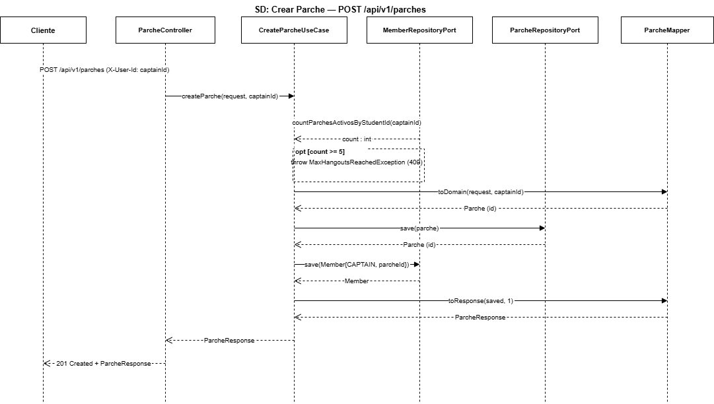
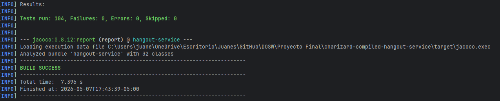
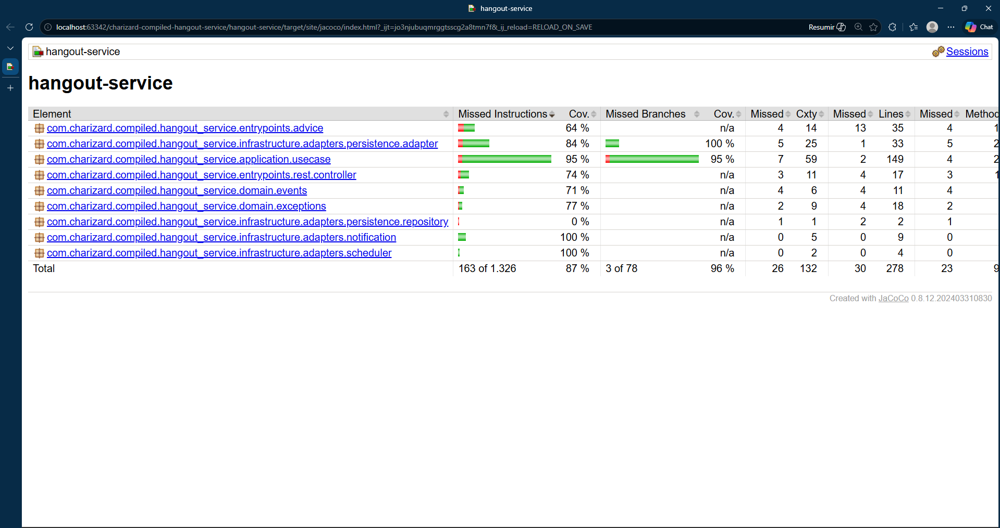

<div align="center">

# 🤝 DOSW — Microservicio de Parches (Hangouts)

### *"Conecta, organiza, comparte — tu próximo parche está a un clic"*

---

### 🛠️ Stack Tecnológico


### ☁️ Infraestructura & Calidad


### 🏗️ Arquitectura


</div>

---

## 📑 Tabla de Contenidos

1. [👤 Integrantes](#1--integrantes)
2. [🎯 Objetivo del Microservicio](#2--objetivo-del-microservicio)
3. [⚡ Funcionalidades Principales](#3--funcionalidades-principales)
4. [📋 Estrategia de Versionamiento y Branches](#4--manejo-de-estrategia-de-versionamiento-y-branches)
   - [4.1 Convenciones para crear ramas](#41-convenciones-para-crear-ramas)
   - [4.2 Convenciones para crear commits](#42-convenciones-para-crear-commits)
5. [⚙️ Tecnologías Utilizadas](#5--tecnologias-utilizadas)
6. [🧩 Funcionalidad](#6--funcionalidad)
7. [📊 Diagramas](#7--diagramas)
8. [⚠️ Manejo de Errores](#8--manejo-de-errores)
9. [🧪 Evidencia de Pruebas y Ejecución](#9--evidencia-de-las-pruebas-y-como-ejecutarlas)
10. [🗂️ Organización del Código](#10--codigo-de-la-implementacion-organizado-en-las-respectivas-carpetas)
11. [🚀 Ejecución del Proyecto](#11--ejecucion-del-proyecto)
12. [☁️ CI/CD y Despliegue en Railway](#12--evidencia-de-cicd-y-despliegue-en-railway)
13. [🤝 Contribuciones](#13--contribuciones)

---

## 1. 👤 Integrantes:

- David Shadday Correa Gonzalez
- Juan Camilo Melo Cupitra
- Juan Esteban Tellez Valencia
- Stiven Esneider Pardo Gutierrez

## 2. 🎯 Objetivo del microservicio

El microservicio de Parches tiene como objetivo gestionar los encuentros sociales y académicos — llamados *parches* (jerga colombiana para reunión/salida grupal) — entre estudiantes dentro de la plataforma DOSW. Este servicio se encarga de crear y administrar parches públicos y privados, controlar la membresía de sus participantes, y gestionar el sistema de invitaciones para parches de acceso restringido. Además, implementa reglas de negocio como cupo máximo por parche, límite de parches activos por estudiante (máx. 5), y archivo automático de parches vencidos, garantizando una experiencia organizada y confiable para todos los usuarios.

---

## 3. ⚡ Funcionalidades principales

<div align="center">

<table>
  <thead>
    <tr>
      <th>💡 Funcionalidad</th>
      <th>Descripción</th>
    </tr>
  </thead>
  <tbody>
    <tr>
      <td><strong>Gestión de Parches</strong></td>
      <td>Crea, consulta, actualiza y archiva parches con datos como nombre, lugar, categoría, tipo (público/privado), cupo máximo y fecha de realización.</td>
    </tr>
    <tr>
      <td><strong>Control de Membresía</strong></td>
      <td>Permite a estudiantes unirse a parches públicos directamente y salir de ellos, respetando reglas de negocio como cupo y límite de parches activos.</td>
    </tr>
    <tr>
      <td><strong>Sistema de Invitaciones</strong></td>
      <td>El capitán puede invitar estudiantes a parches privados; el invitado acepta o rechaza la invitación, lo que desencadena su membresía automáticamente.</td>
    </tr>
    <tr>
      <td><strong>Archivo Automático</strong></td>
      <td>Un scheduler archiva automáticamente los parches cuya fecha de realización ha superado las 24 horas, manteniendo limpio el catálogo activo.</td>
    </tr>
    <tr>
      <td><strong>Notificaciones de Eventos</strong></td>
      <td>Publica eventos internos (nuevo miembro, invitación enviada, invitación aceptada) para integrarse con otros microservicios vía listeners asincrónicos.</td>
    </tr>
  </tbody>
</table>

</div>


## 4. 📋 Manejo de Estrategia de versionamiento y branches

### Estrategia de Ramas (Git Flow)

### Ramas y propósito
- Manejaremos GitFlow, el modelo de ramificación para el control de versiones de Git

#### `main`
- **Propósito:** rama **estable** con la versión final (lista para demo/producción).
- **Reglas:**
    - Solo recibe merges desde `release/*` y `hotfix/*`.
    - Cada merge a `main` debe crear un **tag** SemVer (`vX.Y.Z`).
    - Rama **protegida**: PR obligatorio, 1–2 aprobaciones, checks de CI en verde.

#### `develop`
- **Propósito:** integración continua de trabajo; base de nuevas funcionalidades.
- **Reglas:**
    - Recibe merges desde `feature/*` y también desde `release/*` al finalizar un release.
    - Rama **protegida** similar a `main`.

#### `feature/*`
- **Propósito:** desarrollo de una funcionalidad, refactor o spike.
- **Base:** `develop`.
- **Cierre:** se fusiona a `develop` mediante **PR**


#### `release/*`
- **Propósito:** congelar cambios para estabilizar pruebas, textos y versiones previas al deploy.
- **Base:** `develop`.
- **Cierre:** merge a `main` (crear **tag** `vX.Y.Z`) **y** merge de vuelta a `develop`.
- **Ejemplo de nombre:**  
  `release/1.3.0`

#### `hotfix/*`
- **Propósito:** corregir un bug **crítico** detectado en `main`.
- **Base:** `main`.
- **Cierre:** merge a `main` (crear **tag** de **PATCH**) **y** merge a `develop` para mantener paridad.
- **Ejemplos de nombre:**  
  `hotfix/fix-blank-screen`, `hotfix/css-broken-header`


---

### 4.1 Convenciones para **crear ramas**

#### `feature/*`
**Formato:**
```
feature/[nombre-funcionalidad]
```

**Ejemplos:**
- `feature/gestionParches`
- `feature/sistemaInvitaciones`

**Reglas de nomenclatura:**
- Usar **PascalCase** (palabras separadas por mayúscula)
- Máximo 50 caracteres en total
- Descripción clara y específica de la funcionalidad

#### `release/*`
**Formato:**
```
release/[version]
```
**Ejemplo:** `release/1.0.0`

#### `hotfix/*`
**Formato:**
```
hotfix/[descripcion-breve-del-fix]
```
**Ejemplos:**
- `hotfix/corregirArchivoAutomatico`
- `hotfix/fixValidacionCupo`

---

### 4.2 Convenciones para **crear commits**

#### **Formato:**
```
[tipo]: [descripción específica de la acción]
```

#### **Tipos de commit:**
- `feat`: Nueva funcionalidad
- `fix`: Corrección de errores
- `docs`: Cambios en documentación

## 5. ⚙️ Tecnologías Utilizadas


| **Tecnología / Herramienta** | **Uso principal en el proyecto** |
|------------------------------|----------------------------------|
| **Java 21 (OpenJDK)** | Lenguaje de programación base del microservicio backend, con soporte a records, switch expressions y mejoras modernas. |
| **Spring Boot 4.0.6** | Framework principal para construir el microservicio, exponiendo APIs REST y gestionando configuración e inyección de dependencias. |
| **Spring Web** | Exposición de endpoints REST (controladores HTTP) dentro de la arquitectura hexagonal. |
| **Spring Security** | Configuración de seguridad del microservicio; permite proteger endpoints y controlar el acceso mediante encabezados de identidad. |
| **Spring Data JPA** | Integración del microservicio con la base de datos PostgreSQL usando el patrón Repository y puertos/adaptadores. |
| **PostgreSQL 18** | Base de datos relacional principal, con tablas para `parches`, `members` e `invitations`. Desplegada en Railway. |
| **Flyway** | Gestión y versionado del esquema de base de datos mediante migraciones SQL controladas. |
| **Apache Maven** | Gestión de dependencias, empaquetado del microservicio y automatización de builds en los pipelines CI/CD. |
| **Lombok** | Reducción de código repetitivo con anotaciones como `@Getter`, `@Builder`, `@Data` y `@RequiredArgsConstructor`. |
| **MapStruct** | Generación automática de mappers entre entidades de dominio, entidades de persistencia y DTOs. |
| **JUnit 5** | Framework de pruebas unitarias para validar la lógica de dominio y casos de uso en el microservicio. |
| **Mockito** | Simulación de dependencias (puertos, repositorios) en pruebas unitarias sin acceder a infraestructura real. |
| **JaCoCo** | Generación de reportes de cobertura de código para evaluar la efectividad de las pruebas. |
| **SonarQube** | Análisis estático del código y control de calidad, identificando vulnerabilidades y code smells. |
| **Swagger (OpenAPI 3 / springdoc)** | Generación automática de documentación y prueba interactiva de los endpoints REST. |
| **Postman** | Validación manual de peticiones y respuestas JSON de los endpoints (`POST`, `GET`, `PATCH`, `DELETE`). |
| **Docker** | Contenerización del microservicio con build multi-stage para despliegues aislados y consistentes. |
| **Docker Compose** | Orquestación local de la aplicación y PostgreSQL para desarrollo y pruebas de integración. |
| **Railway** | Plataforma cloud donde se despliega el contenedor Docker del microservicio junto a su base de datos PostgreSQL. |
| **GitHub Actions** | Pipeline de integración y despliegue continuo (CI/CD) para compilar, probar, analizar y desplegar el microservicio. |


> 🧠 **Stack tecnológico seleccionado** para asegurar **escalabilidad**, **modularidad**, **seguridad**, **trazabilidad** y **mantenibilidad**, aplicando buenas prácticas de ingeniería de software.

## 6. 🧩 Funcionalidades

---

### 🔑 Funcionalidades principales

### 1️⃣ Crear Parche

Permite crear un nuevo parche indicando nombre, lugar, categoría, tipo (público/privado), cupo máximo y fecha. El estudiante que lo crea se convierte automáticamente en su capitán.

**Endpoint principal:**  
`POST /api/v1/parches`

---

### 📦 Estructura de la Solicitud (Request)

<div align="center">

| 🏷️ Campo | 🗃️ Tipo | ⚠️ Restricciones | 📝 Descripción |
|---|---|:---:|---|
| name | String | Obligatorio, no vacío | Nombre del parche. |
| description | String | Opcional | Descripción breve del parche. |
| place | String | Obligatorio, no vacío | Lugar de encuentro. |
| category | Enum | Obligatorio | Categoría del parche (MUSIC, PROGRAMMING, SOCCER, etc.). |
| date | LocalDate | Obligatorio, hoy o futuro | Fecha de realización (yyyy-MM-dd). |
| hour | LocalTime | Obligatorio | Hora de inicio (HH:mm:ss). |
| maximumQuota | Integer | 2–30 | Cupo máximo de participantes. |
| type | Enum | Obligatorio | Tipo: PUBLIC o PRIVATE. |
| eventId | UUID | Opcional | ID del evento externo asociado. |

</div>

---

### 📦 Estructura de la Respuesta (Response)

<div align="center">

| 🏷️ Campo | 🗃️ Tipo | 📝 Descripción |
|---|---|---|
| id | UUID | Identificador único del parche creado. |
| name | String | Nombre del parche. |
| description | String | Descripción del parche. |
| place | String | Lugar de encuentro. |
| category | Enum | Categoría del parche. |
| type | Enum | Tipo (PUBLIC / PRIVATE). |
| status | Enum | Estado actual (ACTIVE / FILED). |
| maximumQuota | Integer | Cupo máximo. |
| actualMembers | Integer | Número actual de miembros. |
| captainId | UUID | ID del estudiante capitán. |
| dateRealization | LocalDateTime | Fecha y hora combinadas de realización. |

</div>


---

### ✅ Happy Path (Ejemplo de Uso Exitoso)

1. El capitán envía un POST con los datos del parche e incluye su ID en el header `X-User-Id`.
2. El sistema valida que la fecha sea presente o futura y que el cupo esté entre 2 y 30.
3. Se verifica que el estudiante no haya alcanzado el límite de 5 parches activos.
4. Se crea el parche en estado `ACTIVE` y el capitán queda registrado como primer miembro.
5. Se retorna `201 CREATED` con los datos del parche.

**Request (Solicitud):**
```json
POST /api/v1/parches
Headers: X-User-Id: 550e8400-e29b-41d4-a716-446655440001

{
  "name": "Parche de estudio",
  "description": "Repaso grupal de matemáticas",
  "place": "Café del edificio Bernardo",
  "category": "PROGRAMMING",
  "date": "2026-06-15",
  "hour": "14:00:00",
  "maximumQuota": 10,
  "type": "PUBLIC"
}
```

**Response (Respuesta):**
```json
{
  "id": "770e8400-e29b-41d4-a716-446655440000",
  "name": "Parche de estudio",
  "description": "Repaso grupal de matemáticas",
  "place": "Café del edificio Bernardo",
  "category": "PROGRAMMING",
  "type": "PUBLIC",
  "status": "ACTIVE",
  "maximumQuota": 10,
  "actualMembers": 1,
  "captainId": "550e8400-e29b-41d4-a716-446655440001",
  "dateRealization": "2026-06-15T14:00:00"
}
```

---

### 🖼️ Diagrama de Secuencia



<details>
<summary><strong>🟢 Explicación del Flujo</strong></summary>

El proceso inicia cuando el capitán envía un POST al `ParcheController`. El `CreateParcheUseCase` valida las restricciones de negocio (fecha futura, cupo válido, límite de parches activos). Se crea el parche con estado `ACTIVE`, se persiste en PostgreSQL vía el adaptador de repositorio, y el capitán queda automáticamente inscrito como primer miembro. Se retorna la respuesta con el parche creado.

</details>

---

### 📊 Tipos de errores manejados

<div align="center">

| 🔢 **Código HTTP** | ⚠️ **Escenario** | 💬 **Mensaje de Error** |
|:------------------:|:----------------|:------------------------|
|  | Datos inválidos | `"Name cannot be blank"` |
|  | Fecha pasada | `"Date must be today or in the future"` |
|  | Límite de parches | `"Student has reached the maximum number of active hangouts"` |

</div>

---

### 2️⃣ Consultar Parches

Permite listar todos los parches existentes con filtros opcionales por tipo y estado.

**Endpoint principal:**  
`GET /api/v1/parches`

---

### 📦 Estructura de la Solicitud (Request)

<div align="center">

| 🏷️ Campo | 🗃️ Tipo | ⚠️ Restricciones | 📝 Descripción |
|---|---|:---:|---|
| tipo | Enum | Opcional (query param) | Filtrar por PUBLIC o PRIVATE. |
| estado | Enum | Opcional (query param) | Filtrar por ACTIVE o FILED. |

</div>

---

### 📦 Estructura de la Respuesta (Response)

<div align="center">

| 🏷️ Campo | 🗃️ Tipo | 📝 Descripción |
|---|---|---|
| (lista) | List\<ParcheResponse\> | Lista de parches que cumplen los filtros. |

</div>

---

### ✅ Happy Path (Ejemplo de Uso Exitoso)

1. El cliente consulta los parches enviando filtros opcionales.
2. El sistema ejecuta la búsqueda en la base de datos aplicando los filtros.
3. Se retorna la lista de parches encontrados.

**Request (Solicitud):**
```
GET /api/v1/parches?tipo=PUBLIC&estado=ACTIVE
```

**Response (Respuesta):**
```json
[
  {
    "id": "770e8400-e29b-41d4-a716-446655440000",
    "name": "Parche de estudio",
    "type": "PUBLIC",
    "status": "ACTIVE",
    "actualMembers": 3,
    "maximumQuota": 10,
    "dateRealization": "2026-06-15T14:00:00"
  }
]
```

---

### 🖼️ Diagrama de Secuencia


<details>
<summary><strong>🟢 Explicación del Flujo</strong></summary>

El `ParcheController` recibe la petición con los filtros opcionales y los delega al `GetParcheUseCase`. Este invoca al repositorio para recuperar los parches que coinciden con los criterios. Los resultados se transforman a `ParcheResponse` y se retorna la lista al cliente.

</details>

---

### 📊 Tipos de errores manejados

<div align="center">

| 🔢 **Código HTTP** | ⚠️ **Escenario** | 💬 **Mensaje de Error** |
|:------------------:|:----------------|:------------------------|
|  | Sin resultados | Lista vacía `[]` |
|  | Error interno | `"Unexpected error"` |

</div>

---

### 3️⃣ Consultar Parche por ID

Permite recuperar la información detallada de un parche específico.

**Endpoint principal:**  
`GET /api/v1/parches/{id}`

---

### 📦 Estructura de la Solicitud (Request)

<div align="center">

| 🏷️ Campo | 🗃️ Tipo | ⚠️ Restricciones | 📝 Descripción |
|---|---|:---:|---|
| id | UUID | Obligatorio (path) | Identificador único del parche. |

</div>

---

### ✅ Happy Path (Ejemplo de Uso Exitoso)

1. El cliente envía el `id` del parche en el path.
2. El sistema busca el parche en la base de datos.
3. Si existe, retorna la información completa.

**Request (Solicitud):**
```
GET /api/v1/parches/770e8400-e29b-41d4-a716-446655440000
```

---

### 🖼️ Diagrama de Secuencia


<details>
<summary><strong>🟢 Explicación del Flujo</strong></summary>

El `ParcheController` recibe el UUID del parche. El `GetParcheUseCase` busca el parche por ID en el repositorio. Si no se encuentra, lanza `ParcheNotFoundException`. Si existe, convierte la entidad a `ParcheResponse` y retorna la respuesta con HTTP 200.

</details>

---

### 📊 Tipos de errores manejados

<div align="center">

| 🔢 **Código HTTP** | ⚠️ **Escenario** | 💬 **Mensaje de Error** |
|:------------------:|:----------------|:------------------------|
|  | Parche no existe | `"Parche not found"` |

</div>

---

### 4️⃣ Actualizar Parche

Permite al capitán modificar los datos de un parche existente.

**Endpoint principal:**  
`PATCH /api/v1/parches/{id}`

---

### 📦 Estructura de la Solicitud (Request)

<div align="center">

| 🏷️ Campo | 🗃️ Tipo | ⚠️ Restricciones | 📝 Descripción |
|---|---|:---:|---|
| name | String | Opcional | Nuevo nombre del parche. |
| description | String | Opcional | Nueva descripción. |
| place | String | Opcional | Nuevo lugar de encuentro. |
| category | Enum | Opcional | Nueva categoría. |
| date | LocalDate | Opcional | Nueva fecha (yyyy-MM-dd). |
| hour | LocalTime | Opcional | Nueva hora (HH:mm). |
| maximumQuota | Integer | Opcional, 2–50 | Nuevo cupo máximo. |
| type | Enum | Opcional | Nuevo tipo (PUBLIC / PRIVATE). |
| eventId | UUID | Opcional | Nuevo ID de evento externo. |

</div>

---

### ✅ Happy Path (Ejemplo de Uso Exitoso)

1. El capitán envía un PATCH con los campos a actualizar e incluye su ID en `X-User-Id`.
2. El sistema verifica que el solicitante sea el capitán del parche.
3. Se actualizan únicamente los campos enviados.
4. Se retorna `200 OK` con el parche actualizado.

**Request (Solicitud):**
```json
PATCH /api/v1/parches/770e8400-e29b-41d4-a716-446655440000
Headers: X-User-Id: 550e8400-e29b-41d4-a716-446655440001

{
  "place": "Biblioteca central",
  "maximumQuota": 15
}
```

---

### 🖼️ Diagrama de Secuencia


<details>
<summary><strong>🟢 Explicación del Flujo</strong></summary>

El `ParcheController` delega al `UpdateParcheUseCase`. Este verifica que el solicitante sea el capitán del parche; si no lo es, lanza `AccessDeniedException`. Si la validación pasa, aplica los cambios sobre los campos enviados y persiste la entidad actualizada.

</details>

---

### 📊 Tipos de errores manejados

<div align="center">

| 🔢 **Código HTTP** | ⚠️ **Escenario** | 💬 **Mensaje de Error** |
|:------------------:|:----------------|:------------------------|
|  | No es el capitán | `"Only the captain can update this parche"` |
|  | Parche no existe | `"Parche not found"` |

</div>

---

### 5️⃣ Archivar Parche (Soft Delete)

Permite al capitán archivar un parche, cambiando su estado de `ACTIVE` a `FILED`.

**Endpoint principal:**  
`DELETE /api/v1/parches/{id}`

---

### 📦 Estructura de la Solicitud (Request)

<div align="center">

| 🏷️ Campo | 🗃️ Tipo | ⚠️ Restricciones | 📝 Descripción |
|---|---|:---:|---|
| id | UUID | Obligatorio (path) | Identificador del parche a archivar. |
| X-User-Id | UUID | Obligatorio (header) | ID del estudiante que solicita el archivo. |

</div>

---

### ✅ Happy Path (Ejemplo de Uso Exitoso)

1. El capitán envía un DELETE con su ID en el header.
2. El sistema verifica que sea el capitán.
3. El parche pasa a estado `FILED` (no se elimina físicamente).
4. Se retorna `204 No Content`.

**Request (Solicitud):**
```
DELETE /api/v1/parches/770e8400-e29b-41d4-a716-446655440000
Headers: X-User-Id: 550e8400-e29b-41d4-a716-446655440001
```

---

### 🖼️ Diagrama de Secuencia


<details>
<summary><strong>🟢 Explicación del Flujo</strong></summary>

El `CloseParcheUseCase` valida que el solicitante es el capitán del parche. Si la verificación es exitosa, cambia el estado del parche a `FILED` y lo persiste. La operación es un soft delete: el registro permanece en la base de datos pero deja de aparecer en listados activos.

</details>

---

### 📊 Tipos de errores manejados

<div align="center">

| 🔢 **Código HTTP** | ⚠️ **Escenario** | 💬 **Mensaje de Error** |
|:------------------:|:----------------|:------------------------|
|  | No es el capitán | `"Only the captain can archive this parche"` |
|  | Parche no existe | `"Parche not found"` |

</div>

---

### 6️⃣ Unirse a un Parche Público

Permite a un estudiante unirse directamente a un parche público activo sin necesidad de invitación.

**Endpoint principal:**  
`POST /api/v1/parches/{parcheId}/miembros`

---

### 📦 Estructura de la Solicitud (Request)

<div align="center">

| 🏷️ Campo | 🗃️ Tipo | ⚠️ Restricciones | 📝 Descripción |
|---|---|:---:|---|
| parcheId | UUID | Obligatorio (path) | ID del parche al que desea unirse. |
| X-User-Id | UUID | Obligatorio (header) | ID del estudiante. |

</div>

---

### 📦 Estructura de la Respuesta (Response)

<div align="center">

| 🏷️ Campo | 🗃️ Tipo | 📝 Descripción |
|---|---|---|
| id | UUID | Identificador único de la membresía. |
| parcheId | UUID | ID del parche. |
| studentId | UUID | ID del estudiante. |
| memberRole | Enum | Rol del miembro (STUDENT / CAPTAIN). |
| unionDate | LocalDateTime | Fecha y hora de ingreso. |

</div>

---

### ✅ Happy Path (Ejemplo de Uso Exitoso)

1. El estudiante envía un POST con el `parcheId` en el path y su ID en el header.
2. El sistema verifica que el parche esté activo y no archivado.
3. Se valida que el estudiante no sea ya miembro y que haya cupo disponible.
4. Se verifica que el estudiante no tenga 5 parches activos.
5. Se crea la membresía y se retorna `201 CREATED`.

**Request (Solicitud):**
```
POST /api/v1/parches/770e8400-e29b-41d4-a716-446655440000/miembros
Headers: X-User-Id: 880e8400-e29b-41d4-a716-446655440002
```

**Response (Respuesta):**
```json
{
  "id": "990e8400-e29b-41d4-a716-446655440003",
  "parcheId": "770e8400-e29b-41d4-a716-446655440000",
  "studentId": "880e8400-e29b-41d4-a716-446655440002",
  "memberRole": "STUDENT",
  "unionDate": "2026-05-06T10:30:00"
}
```

---

### 🖼️ Diagrama de Secuencia


<details>
<summary><strong>🟢 Explicación del Flujo</strong></summary>

El `MemberController` delega al `JoinParcheUseCase`. Este verifica que el parche exista y esté activo, que no haya superado su cupo máximo, que el estudiante no sea miembro ya, y que el estudiante no tenga más de 5 parches activos. Si todo es válido, se persiste la membresía y se publica un `NuevoMiembroEvent`.

</details>

---

### 📊 Tipos de errores manejados

<div align="center">

| 🔢 **Código HTTP** | ⚠️ **Escenario** | 💬 **Mensaje de Error** |
|:------------------:|:----------------|:------------------------|
|  | Parche archivado | `"Cannot join a filed parche"` |
|  | Parche no existe | `"Parche not found"` |
|  | Ya es miembro | `"Student is already a member of this parche"` |
|  | Cupo lleno | `"Maximum capacity reached"` |
|  | Límite de parches | `"Student has reached the maximum number of active hangouts"` |

</div>

---

### 7️⃣ Salir de un Parche

Permite a un estudiante abandonar voluntariamente un parche del que es miembro.

**Endpoint principal:**  
`DELETE /api/v1/parches/{parcheId}/miembros`

---

### 📦 Estructura de la Solicitud (Request)

<div align="center">

| 🏷️ Campo | 🗃️ Tipo | ⚠️ Restricciones | 📝 Descripción |
|---|---|:---:|---|
| parcheId | UUID | Obligatorio (path) | ID del parche. |
| X-User-Id | UUID | Obligatorio (header) | ID del estudiante que desea salir. |

</div>

---

### ✅ Happy Path (Ejemplo de Uso Exitoso)

1. El estudiante envía un DELETE con su ID en el header.
2. El sistema verifica que sea miembro del parche y que no sea el capitán.
3. Se elimina la membresía y se retorna `204 No Content`.

**Request (Solicitud):**
```
DELETE /api/v1/parches/770e8400-e29b-41d4-a716-446655440000/miembros
Headers: X-User-Id: 880e8400-e29b-41d4-a716-446655440002
```

---

### 🖼️ Diagrama de Secuencia


<details>
<summary><strong>🟢 Explicación del Flujo</strong></summary>

El `LeaveParcheUseCase` verifica que el parche esté activo y que el estudiante sea miembro. Si el estudiante es el capitán, se lanza una excepción indicando que debe transferir el liderazgo primero. Si la validación pasa, se elimina la membresía de la base de datos.

</details>

---

### 📊 Tipos de errores manejados

<div align="center">

| 🔢 **Código HTTP** | ⚠️ **Escenario** | 💬 **Mensaje de Error** |
|:------------------:|:----------------|:------------------------|
|  | Es el capitán | `"Captain must transfer leadership before leaving"` |
|  | Parche archivado | `"Cannot leave a filed parche"` |
|  | No es miembro | `"Member not found in this parche"` |

</div>

---

### 8️⃣ Enviar Invitación

Permite al capitán de un parche privado invitar a un estudiante específico.

**Endpoint principal:**  
`POST /api/v1/parches/{parcheId}/invitaciones/{studentId}`

---

### 📦 Estructura de la Solicitud (Request)

<div align="center">

| 🏷️ Campo | 🗃️ Tipo | ⚠️ Restricciones | 📝 Descripción |
|---|---|:---:|---|
| parcheId | UUID | Obligatorio (path) | ID del parche privado. |
| studentId | UUID | Obligatorio (path) | ID del estudiante a invitar. |
| X-User-Id | UUID | Obligatorio (header) | ID del capitán que envía la invitación. |

</div>

---

### 📦 Estructura de la Respuesta (Response)

<div align="center">

| 🏷️ Campo | 🗃️ Tipo | 📝 Descripción |
|---|---|---|
| id | UUID | Identificador único de la invitación. |
| parcheId | UUID | ID del parche al que se invita. |
| invitedStudentId | UUID | ID del estudiante invitado. |
| status | Enum | Estado de la invitación (PENDING). |
| sentAt | LocalDateTime | Fecha y hora de envío. |
| respondedAt | LocalDateTime | Fecha y hora de respuesta (null si pendiente). |

</div>

---

### ✅ Happy Path (Ejemplo de Uso Exitoso)

1. El capitán envía un POST con el ID del parche y el ID del estudiante a invitar.
2. El sistema verifica que el solicitante sea el capitán del parche.
3. Se valida que el estudiante no sea ya miembro y no tenga una invitación pendiente.
4. Se crea la invitación con estado `PENDING` y se retorna `201 CREATED`.

**Request (Solicitud):**
```
POST /api/v1/parches/770e8400-e29b-41d4-a716-446655440000/invitaciones/880e8400-e29b-41d4-a716-446655440002
Headers: X-User-Id: 550e8400-e29b-41d4-a716-446655440001
```

**Response (Respuesta):**
```json
{
  "id": "aa0e8400-e29b-41d4-a716-446655440004",
  "parcheId": "770e8400-e29b-41d4-a716-446655440000",
  "invitedStudentId": "880e8400-e29b-41d4-a716-446655440002",
  "status": "PENDING",
  "sentAt": "2026-05-06T11:00:00",
  "respondedAt": null
}
```

---

### 🖼️ Diagrama de Secuencia


<details>
<summary><strong>🟢 Explicación del Flujo</strong></summary>

El `InvitationUseCase` verifica que el remitente sea el capitán. Luego confirma que el estudiante no sea ya miembro del parche y que no tenga una invitación activa pendiente. Si todo es válido, crea la invitación con estado `PENDING`, la persiste y publica un `InvitationSentEvent` para notificaciones.

</details>

---

### 📊 Tipos de errores manejados

<div align="center">

| 🔢 **Código HTTP** | ⚠️ **Escenario** | 💬 **Mensaje de Error** |
|:------------------:|:----------------|:------------------------|
|  | No es el capitán | `"Only the captain can send invitations"` |
|  | Ya es miembro | `"Student is already a member"` |
|  | Invitación duplicada | `"Student already has a pending invitation"` |

</div>

---

### 9️⃣ Responder Invitación

Permite al estudiante invitado aceptar o rechazar una invitación pendiente.

**Endpoint principal:**  
`PATCH /api/v1/invitaciones/{invitationId}`

---

### 📦 Estructura de la Solicitud (Request)

<div align="center">

| 🏷️ Campo | 🗃️ Tipo | ⚠️ Restricciones | 📝 Descripción |
|---|---|:---:|---|
| invitationId | UUID | Obligatorio (path) | ID de la invitación a responder. |
| X-User-Id | UUID | Obligatorio (header) | ID del estudiante invitado. |
| answer | Enum | Obligatorio (body) | Respuesta: ACCEPTED o REJECTED. |

</div>

---

### ✅ Happy Path (Ejemplo de Uso Exitoso)

1. El estudiante invitado envía PATCH con su respuesta y su ID en el header.
2. El sistema verifica que sea el destinatario de la invitación.
3. Verifica que la invitación esté en estado `PENDING`.
4. Si acepta: se crea automáticamente la membresía en el parche.
5. La invitación queda con estado `ACCEPTED` o `REJECTED`.

**Request (Solicitud):**
```json
PATCH /api/v1/invitaciones/aa0e8400-e29b-41d4-a716-446655440004
Headers: X-User-Id: 880e8400-e29b-41d4-a716-446655440002

{
  "answer": "ACCEPTED"
}
```

**Response (Respuesta):**
```json
{
  "id": "aa0e8400-e29b-41d4-a716-446655440004",
  "parcheId": "770e8400-e29b-41d4-a716-446655440000",
  "invitedStudentId": "880e8400-e29b-41d4-a716-446655440002",
  "status": "ACCEPTED",
  "sentAt": "2026-05-06T11:00:00",
  "respondedAt": "2026-05-06T11:30:00"
}
```

---

### 🖼️ Diagrama de Secuencia


<details>
<summary><strong>🟢 Explicación del Flujo</strong></summary>

El `RespondInvitationUseCase` verifica que el estudiante sea el destinatario de la invitación y que ésta esté en estado `PENDING`. Si acepta, se verifica que el parche tenga cupo disponible y se crea la membresía. La invitación se actualiza con el estado final y la fecha de respuesta. Se publica un `InvitationAcceptedEvent` en caso de aceptación.

</details>

---

### 📊 Tipos de errores manejados

<div align="center">

| 🔢 **Código HTTP** | ⚠️ **Escenario** | 💬 **Mensaje de Error** |
|:------------------:|:----------------|:------------------------|
|  | No es el invitado | `"You are not the invited student"` |
|  | Invitación no existe | `"Invitation not found"` |
|  | Ya respondida | `"Invitation has already been responded"` |
|  | Parche lleno | `"Maximum capacity reached"` |

</div>

---

## 7. 📊 Diagramas

Esta sección muestra los diagramas clave del microservicio de parches, ilustrando su arquitectura, componentes principales y despliegue.

---

### 🏗️ Diagrama de Componentes — Vista General
<div align="center">

</div>


---

### 🔍 Diagrama de Componentes — Vista Específica

<div align="center">

</div>

**Arquitectura Hexagonal:**  
El microservicio de Parches separa controladores, casos de uso, lógica de negocio y adaptadores externos para mantener modularidad y escalabilidad.

**Flujo principal:**

- **ParcheController / MemberController / InvitationController**
  - Reciben solicitudes HTTP y las delegan a los puertos de entrada correspondientes.

**Lógica de Negocio (Dominio):**

- **Casos de Uso (Application Layer)**
  - `CreateParcheUseCase`, `GetParcheUseCase`, `UpdateParcheUseCase`, `CloseParcheUseCase`
  - `JoinParcheUseCase`, `LeaveParcheUseCase`
  - `InvitationUseCase`, `RespondInvitationUseCase`
  - Cada caso de uso implementa un puerto de entrada y orquesta la lógica mediante puertos de salida.

- **ParcheArchiveScheduler**
  - Tarea programada que se ejecuta periódicamente para archivar parches vencidos (>24h transcurridas).

**Integración y Adaptadores:**

- **Persistencia:**
  - Adaptadores `ParcheRepositoryAdapter`, `MemberRepositoryAdapter`, `InvitationRepositoryAdapter` implementan los puertos de salida.
  - Mappers (MapStruct) traducen entre entidades de dominio y entidades JPA.
  - Persiste en PostgreSQL con queries Spring Data JPA.

- **Notificaciones:**
  - `NotificacionEventListener` escucha eventos de dominio (`NuevoMiembroEvent`, `InvitationSentEvent`, `InvitationAcceptedEvent`) y los reenvía vía `NotificacionAdapter`.

- **Manejo de Errores:**
  - `GlobalExceptionHandler` centraliza el manejo de excepciones de dominio.

> El microservicio de Parches gestiona todo el ciclo de vida de los encuentros estudiantiles, integrándose con otros servicios del ecosistema DOSW a través de eventos.


### 🔌 Servicios Externos Integrados

El microservicio se integra con otros sistemas del ecosistema DOSW.

<div align="center">

| 🌍 **Microservicio** | ⚙️ **Operación** | 📋 **Propósito** |
|:---------------|:----------------|:-----------------------|
| **Gamification** | Nuevo miembro / Invitación aceptada | Disparar recompensas o puntos al unirse a un parche |
| **Notification** | Invitación enviada / Nuevo miembro | Enviar notificaciones push a los estudiantes |
| **User Service** | Validación de identidad | Verificar que el `X-User-Id` corresponde a un estudiante activo |

</div>

**Dominio y Mapeo:**

- Las entidades `Parche`, `Member` e `Invitation` encapsulan la lógica central.
- Los mappers MapStruct transforman los datos entre capas de forma segura y sin reflexión en tiempo de ejecución.

> El diagrama ilustra cómo el dominio de parches se mantiene aislado de la infraestructura, permitiendo cambiar la base de datos o los adaptadores externos sin afectar las reglas de negocio.


---
### 📊 Diagrama de base de datos

<div align="center">

</div>

El microservicio de Parches utiliza **PostgreSQL 18** como motor de base de datos relacional. Contiene tres tablas principales: `parches`, `members` e `invitations`.

#### 📋 Tabla: `parches`

<div align="center">

| 🏷️ Campo | 🗃️ Tipo | 📝 Descripción | ⚠️ Restricciones |
|:---|:---|:---|:---|
| **id** | `UUID` | Identificador único del parche | Primary Key, `gen_random_uuid()` |
| **name** | `VARCHAR(100)` | Nombre del parche | NOT NULL |
| **description** | `VARCHAR(500)` | Descripción del parche | Opcional |
| **place** | `VARCHAR(200)` | Lugar de encuentro | NOT NULL |
| **category** | `VARCHAR(20)` | Categoría (MUSIC, SOCCER, etc.) | Opcional |
| **type** | `VARCHAR(20)` | Tipo: PUBLIC o PRIVATE | NOT NULL, CHECK |
| **date** | `DATE` | Fecha de realización | NOT NULL |
| **hour** | `TIME` | Hora de inicio | NOT NULL |
| **maximum_quota** | `INTEGER` | Cupo máximo de participantes | NOT NULL, CHECK (2–30) |
| **date_realization** | `TIMESTAMP` | Fecha y hora combinadas | NOT NULL |
| **status** | `VARCHAR(20)` | Estado: ACTIVE o FILED | NOT NULL, DEFAULT 'ACTIVE' |
| **captain_id** | `UUID` | ID del capitán del parche | NOT NULL |
| **creation_date** | `TIMESTAMP` | Fecha de creación | NOT NULL, DEFAULT now() |
| **event_id** | `UUID` | ID de evento externo asociado | Opcional |

</div>

#### 📋 Tabla: `members`

<div align="center">

| 🏷️ Campo | 🗃️ Tipo | 📝 Descripción | ⚠️ Restricciones |
|:---|:---|:---|:---|
| **id** | `UUID` | Identificador único de la membresía | Primary Key |
| **parche_id** | `UUID` | Parche al que pertenece | FK → parches(id) |
| **student_id** | `UUID` | ID del estudiante miembro | NOT NULL |
| **union_date** | `TIMESTAMP` | Fecha de ingreso al parche | NOT NULL, DEFAULT now() |
| **member_role** | `VARCHAR(20)` | Rol: CAPTAIN o STUDENT | NOT NULL, CHECK |

</div>

#### 📋 Tabla: `invitations`

<div align="center">

| 🏷️ Campo | 🗃️ Tipo | 📝 Descripción | ⚠️ Restricciones |
|:---|:---|:---|:---|
| **id** | `UUID` | Identificador único de la invitación | Primary Key |
| **parche_id** | `UUID` | Parche al que se invita | FK → parches(id) |
| **captain_id** | `UUID` | ID del capitán que envió la invitación | NOT NULL |
| **invited_student_id** | `UUID` | ID del estudiante invitado | NOT NULL |
| **status** | `VARCHAR(20)` | Estado: PENDING, ACCEPTED o REJECTED | NOT NULL, DEFAULT 'PENDING' |
| **sent_at** | `TIMESTAMP` | Fecha de envío de la invitación | NOT NULL |
| **responded_at** | `TIMESTAMP` | Fecha de respuesta | Opcional |

</div>

---

### 📦 Diagrama de Clases del Dominio

<div align="center">

</div>

**Resumen del diseño de dominio:**

La arquitectura de dominio se centra en las entidades **Parche**, **Member** e **Invitation**.

- **Entidad de Dominio:** `Parche` contiene identificadores, datos del encuentro y lista de miembros. El campo `status` gestiona su ciclo de vida (ACTIVE → FILED).
- **Membresía:** `Member` vincula un estudiante con un parche y almacena su rol (CAPTAIN/STUDENT) y fecha de ingreso.
- **Invitación:** `Invitation` controla el flujo de incorporación a parches privados con su propio ciclo de vida (PENDING → ACCEPTED/REJECTED).
- **Enumeraciones:** `ParcheType`, `ParcheStatus`, `ParcheCategory`, `MemberRole` e `InvitationStatus` garantizan valores controlados en todo el dominio.

> Este diseño asegura la integridad de los parches y permite extender las funcionalidades sin afectar las reglas de negocio centrales.


---

### 📦 DTOs Principales

<div align="center">
<div style="background:#111; color:#fff; border-radius:12px; padding:24px 12px; box-shadow:0 2px 12px #0002;">

<table style="border:2px solid #4A90E2; border-radius:8px;">
  <caption style="font-size:1.15em; font-weight:bold; color:#4A90E2; padding:8px;">📨 <u>Request DTOs</u></caption>
  <thead style="background:#222; color:#fff;">
    <tr>
      <th style="padding:8px;">DTO</th>
      <th style="padding:8px;">Atributos Principales</th>
      <th style="padding:8px;">Descripción</th>
    </tr>
  </thead>
  <tbody>
    <tr>
      <td><b>CreateParcheRequest</b></td>
      <td>name, description, place, category, date, hour, maximumQuota, type, eventId</td>
      <td>Solicitud para crear un nuevo parche. Valida fecha futura y cupo entre 2 y 30.</td>
    </tr>
    <tr>
      <td><b>UpdateParcheRequest</b></td>
      <td>name, description, place, category, date, hour, maximumQuota, type, eventId</td>
      <td>Actualización parcial de datos del parche. Todos los campos son opcionales.</td>
    </tr>
    <tr>
      <td><b>RespondInvitationRequest</b></td>
      <td>answer (ACCEPTED / REJECTED)</td>
      <td>Respuesta del estudiante invitado a una invitación pendiente.</td>
    </tr>
  </tbody>
</table>

<br>

<table style="border:2px solid #43A047; border-radius:8px;">
  <caption style="font-size:1.15em; font-weight:bold; color:#43A047; padding:8px;">📤 <u>Response DTOs</u></caption>
  <thead style="background:#222; color:#fff;">
    <tr>
      <th style="padding:8px;">DTO</th>
      <th style="padding:8px;">Atributos Principales</th>
      <th style="padding:8px;">Descripción</th>
    </tr>
  </thead>
  <tbody>
    <tr>
      <td><b>ParcheResponse</b></td>
      <td>id, name, description, place, category, type, status, maximumQuota, actualMembers, captainId, dateRealization</td>
      <td>Respuesta completa con los datos del parche, incluyendo conteo de miembros.</td>
    </tr>
    <tr>
      <td><b>MemberResponse</b></td>
      <td>id, parcheId, studentId, memberRole, unionDate</td>
      <td>Confirmación de membresía con rol y fecha de ingreso.</td>
    </tr>
    <tr>
      <td><b>InvitationResponse</b></td>
      <td>id, parcheId, invitedStudentId, status, sentAt, respondedAt</td>
      <td>Estado actual de una invitación con sus timestamps.</td>
    </tr>
    <tr>
      <td><b>ErrorResponse</b></td>
      <td>status, message</td>
      <td>Estructura estandarizada para el retorno de excepciones.</td>
    </tr>
  </tbody>
</table>

<br>

<table style="border:2px solid #F0AD4E; border-radius:8px;">
  <caption style="font-size:1.15em; font-weight:bold; color:#F0AD4E; padding:8px;">⚙️ <u>Enums del Dominio</u></caption>
  <thead style="background:#222; color:#fff;">
    <tr>
      <th style="padding:8px;">Enum</th>
      <th style="padding:8px;">Valores</th>
      <th style="padding:8px;">Descripción</th>
    </tr>
  </thead>
  <tbody>
    <tr>
      <td><b>ParcheType</b></td>
      <td>PUBLIC, PRIVATE</td>
      <td>Tipo de acceso al parche (libre o por invitación).</td>
    </tr>
    <tr>
      <td><b>ParcheStatus</b></td>
      <td>ACTIVE, FILED</td>
      <td>Estado del ciclo de vida del parche.</td>
    </tr>
    <tr>
      <td><b>ParcheCategory</b></td>
      <td>MUSIC, PROGRAMMING, PHOTOGRAPHY, DESIGN, SOCCER, HIKING, READING, GAMING, GASTRONOMY, YOGA, ENTREPRENEURSHIP, ART, CINEMA, DANCE, VOLUNTEERING, COOKING</td>
      <td>Categoría temática del parche.</td>
    </tr>
    <tr>
      <td><b>MemberRole</b></td>
      <td>CAPTAIN, STUDENT</td>
      <td>Rol del miembro dentro del parche.</td>
    </tr>
    <tr>
      <td><b>InvitationStatus</b></td>
      <td>PENDING, ACCEPTED, REJECTED</td>
      <td>Estado de la invitación en su ciclo de vida.</td>
    </tr>
  </tbody>
</table>

</div>
</div>

---

### 🗄️ Diagrama de Despliegue

<div align="center">

</div>

---

#### 🚀 Despliegue e Infraestructura

El microservicio de **Parches** se ejecuta como un contenedor Docker en **Railway**, respaldado por una arquitectura robusta de CI/CD.

- **Ejecución:** Contenedor Docker en Railway (imagen construida con Dockerfile multi-stage).
- **Base de datos:** **PostgreSQL 18** provisionada por Railway con variables de entorno inyectadas automáticamente (`PGHOST`, `PGPORT`, `PGDATABASE`, `PGUSER`, `PGPASSWORD`).
- **CI/CD (GitHub Actions):**
  - Pruebas unitarias (JUnit 5), cobertura (JaCoCo), calidad (SonarQube).
  - Tests de integración contra PostgreSQL 18 en servicio de GitHub Actions.
  - Despliegue automático a Railway vía deploy hook en merges a `main`.
- **Construcción:** Dockerfile multi-stage (Maven Build → JRE 21 Alpine Runtime).
- **Configuración:** Variables de entorno gestionadas desde Railway dashboard.

<div align="center">

| 🌐 **Componente** | 📝 **Descripción** |
|------------------|-------------------|
| Railway App | Hosting del contenedor Docker del microservicio |
| Railway PostgreSQL | Base de datos relacional gestionada con backups |
| GitHub Actions | Automatización de CI/CD y calidad de código |
| Swagger UI | Documentación interactiva en `/swagger-ui/index.html` |

</div>


---

## 8. ⚠️ Manejo de Errores

El microservicio de **Parches** implementa un **mecanismo centralizado de manejo de errores** que garantiza uniformidad, claridad y seguridad en todas las respuestas enviadas al cliente cuando ocurre un fallo.

---

### 🧠 Estrategia general de manejo de errores

El sistema utiliza una **clase global** `GlobalExceptionHandler` con la anotación `@ControllerAdvice` que intercepta todas las excepciones lanzadas desde los controladores REST. Cada excepción de dominio se transforma en una respuesta **JSON estandarizada** con el código HTTP apropiado.


---

### ⚙️ Global Exception Handler

El **Global Exception Handler** captura y maneja todas las excepciones del sistema de forma centralizada. Utiliza métodos con `@ExceptionHandler` para procesar cada tipo de error.

**✨ Características principales:**

- ✅ **Centraliza** la captura de excepciones desde todos los controladores
- ✅ **Retorna mensajes JSON consistentes** con el mismo formato estructurado
- ✅ **Asigna códigos HTTP** según la naturaleza del error (400, 403, 404, 409, 500)
- ✅ **Define mensajes descriptivos** que ayudan tanto al desarrollador como al usuario
- ✅ **Mantiene la aplicación limpia**, eliminando bloques try-catch redundantes
- ✅ **Mejora la trazabilidad** y facilita la depuración en entornos de prueba y producción


---

### 🧩 Excepciones de dominio manejadas

<div align="center">

| ⚠️ **Excepción** | 🔢 **HTTP** | 💬 **Escenario** |
|:----------------|:----------:|:----------------|
| `ParcheNotFoundException` | 404 | El parche solicitado no existe en la base de datos |
| `AccessDeniedException` | 403 | El usuario no tiene permisos para la operación (ej. no es el capitán) |
| `MaximumCapacityReachedException` | 409 | El parche ya alcanzó su cupo máximo de participantes |
| `MaxHangoutsReachedException` | 409 | El estudiante ya tiene 5 parches activos simultáneos |
| `StudentAlreadyMemberException` | 409 | El estudiante ya es miembro del parche |
| `DuplicateInvitationException` | 409 | Ya existe una invitación pendiente para ese estudiante en ese parche |
| `InvitationAlreadyRespondedException` | 409 | La invitación ya fue aceptada o rechazada previamente |
| `ConstraintViolationException` | 400 | Violación de restricción de base de datos (ej. datos inconsistentes) |
| `MethodArgumentNotValidException` | 400 | Validación de campos del DTO fallida (`@NotBlank`, `@Min`, etc.) |
| `IllegalArgumentException` | 400 | Argumento inválido en la lógica de negocio |
| `RuntimeException` | 500 | Error inesperado del servidor |

</div>

---

### ✅ Beneficios del manejo centralizado

<div align="center">

| 🎯 **Beneficio** | 📋 **Descripción** |
|:-----------------|:-------------------|
| **🎯 Uniformidad** | Todas las respuestas de error tienen el mismo formato JSON estandarizado |
| **🔧 Mantenibilidad** | Agregar nuevas excepciones no requiere modificar cada controlador |
| **🔒 Seguridad** | Oculta los detalles internos del servidor y evita exponer trazas sensibles |
| **📍 Trazabilidad** | Cada error incluye el código HTTP y descripción del fallo |
| **🤝 Integración fluida** | Facilita la comunicación con frontend y herramientas como Postman/Swagger |

</div>

---

> Gracias a este enfoque, el microservicio de Parches logra un manejo de errores **robusto**, **escalable** y **seguro**, garantizando una experiencia de usuario más confiable y profesional.

---


---

## 9. 🧪 Evidencia de las pruebas y cómo ejecutarlas

El microservicio de **Parches** implementa una **estrategia integral de pruebas** que garantiza la calidad, funcionalidad y confiabilidad del código mediante pruebas unitarias y de integración.

---

### 🎯 Tipos de pruebas implementadas

<div align="center">

| 🧪 **Tipo de Prueba** | 📋 **Descripción** | 🛠️ **Herramientas** |
|:---------------------|:-------------------|:--------------------|
| **Pruebas Unitarias** | Validan el funcionamiento aislado de casos de uso, controladores y lógica de dominio con mocks |   |
| **Pruebas de Integración** | Verifican la interacción real entre capas contra una base de datos PostgreSQL |  |
| **Cobertura de Código** | Mide el porcentaje de código cubierto por las pruebas |  |

</div>

---

### 🚀 Cómo ejecutar las pruebas

#### **1️⃣ Ejecutar pruebas unitarias**

```bash
mvn test
```

Este comando ejecuta solo las pruebas unitarias (excluye las de integración).

#### **2️⃣ Ejecutar pruebas de integración**

Requiere una instancia de PostgreSQL corriendo (usa `docker compose up -d postgres`):

```bash
mvn failsafe:integration-test failsafe:verify
```

#### **3️⃣ Ejecutar todas las pruebas**

```bash
mvn verify
```

#### **4️⃣ Generar reporte de cobertura con JaCoCo**

```bash
mvn clean test jacoco:report
```

El reporte HTML se generará en:
```
target/site/jacoco/index.html
```

#### **5️⃣ Ejecutar pruebas desde IntelliJ IDEA**

1. Click derecho sobre la carpeta `src/test/java`
2. Selecciona **"Run 'Tests in...'**
3. Ver resultados en el panel inferior

#### **6️⃣ Ejecutar una prueba específica**

```bash
mvn test -Dtest=RespondInvitationUseCaseTest
```

---

### 🧪 Ejemplo de prueba de integración

A continuación se muestra un ejemplo real de una prueba de integración para el controlador de invitaciones, donde se valida el flujo completo de aceptación contra una base de datos real.

```java
@Test
void accept_successFlow_createsMembership() throws Exception {
    RespondInvitationRequest request = new RespondInvitationRequest();
    request.setAnswer(InvitationStatus.ACCEPTED);

    mockMvc.perform(patch("/api/v1/invitaciones/{id}", invitationId)
                    .contentType(MediaType.APPLICATION_JSON)
                    .content(objectMapper.writeValueAsString(request))
                    .header("X-User-Id", studentId.toString()))
            .andExpect(status().isOk())
            .andExpect(jsonPath("$.status").value("ACCEPTED"));

    assertTrue(memberRepository.existsByParcheIdAndStudentId(parcheId, studentId));
}
```


---

### 🖼️ Evidencias de ejecución

1. **Consola mostrando pruebas ejecutándose exitosamente**

    

2. **Reporte JaCoCo con cobertura de código**

    

---

### ✅ Criterios de aceptación de pruebas

Para considerar el sistema correctamente probado, se debe cumplir:

- ✅ **Todas las pruebas en estado PASSED** (sin fallos)
- ✅ **Cero errores de compilación** en el código de pruebas
- ✅ **Pruebas de casos felices y casos de error** implementadas
- ✅ **Pruebas de integración** verifican flujos completos contra BD real

---

### 🔄 Integración con CI/CD

Las pruebas se ejecutan automáticamente en cada **push** o **pull request** mediante GitHub Actions:

```yaml
- name: Tests unitarios
  run: mvn test

- name: Tests de integración
  run: mvn failsafe:integration-test failsafe:verify
```

Esto garantiza que ningún cambio roto llegue a producción.

---

## 10. 🗂️ Código de la implementación organizado en las respectivas carpetas

El microservicio de **Parches** sigue una **arquitectura hexagonal (puertos y adaptadores)** que separa las responsabilidades en capas bien definidas, promoviendo la escalabilidad, testabilidad y mantenibilidad del código.

---

### 📂 Estructura general del proyecto (Scaffolding)

```
charizard-compiled-hangout-service/
│
├── 📁 src/
│   ├── 📁 main/
│   │   ├── 📁 java/com/charizard/compiled/hangout_service/
│   │   │   │
│   │   │   ├── 📁 application/                              # 🔵 CAPA DE APLICACIÓN
│   │   │   │   ├── 📁 dto/
│   │   │   │   │   ├── 📁 request/   (CreateParcheRequest, UpdateParcheRequest, RespondInvitationRequest)
│   │   │   │   │   └── 📁 response/  (ParcheResponse, MemberResponse, InvitationResponse, ErrorResponse)
│   │   │   │   ├── 📁 mapper/        (ParcheMapper)
│   │   │   │   └── 📁 usecase/       (CreateParche, GetParche, UpdateParche, CloseParche, JoinParche,
│   │   │   │                          LeaveParche, InvitationUseCase, RespondInvitationUseCase, ArchiveParche)
│   │   │   │
│   │   │   ├── 📁 domain/                                   # 🟢 CAPA DE DOMINIO
│   │   │   │   ├── 📁 events/        (NuevoMiembroEvent, InvitationSentEvent, InvitationAcceptedEvent)
│   │   │   │   ├── 📁 exceptions/    (ParcheNotFoundException, AccessDeniedException, ...)
│   │   │   │   ├── 📁 model/         (Parche, Member, Invitation)
│   │   │   │   │   └── 📁 enums/     (ParcheType, ParcheStatus, ParcheCategory, MemberRole, InvitationStatus)
│   │   │   │   └── 📁 ports/
│   │   │   │       ├── 📁 in/        (Input ports / interfaces de casos de uso)
│   │   │   │       └── 📁 out/       (Output ports / interfaces de repositorios y notificaciones)
│   │   │   │
│   │   │   ├── 📁 entrypoints/                              # 🟠 ENTRADA (DRIVING ADAPTERS)
│   │   │   │   ├── 📁 advice/        (GlobalExceptionHandler)
│   │   │   │   └── 📁 rest/controller/ (ParcheController, MemberController, InvitationController)
│   │   │   │
│   │   │   └── 📁 infrastructure/                           # 🟠 INFRAESTRUCTURA (DRIVEN ADAPTERS)
│   │   │       ├── 📁 adapters/
│   │   │       │   ├── 📁 notification/  (NotificacionAdapter, NotificacionEventListener)
│   │   │       │   ├── 📁 persistence/
│   │   │       │   │   ├── 📁 adapter/   (ParcheRepositoryAdapter, MemberRepositoryAdapter, InvitationRepositoryAdapter)
│   │   │       │   │   ├── 📁 entity/    (ParcheEntity, MemberEntity, InvitationEntity)
│   │   │       │   │   ├── 📁 mapper/    (ParcheEntityMapper, MemberEntityMapper, InvitationEntityMapper)
│   │   │       │   │   └── 📁 repository/ (ParcheRepository, MemberRepository, InvitationRepository)
│   │   │       │   └── 📁 scheduler/     (ParcheArchiveScheduler)
│   │   │       └── 📁 config/            (SecurityConfig, SwaggerConfig, AsyncConfig, FlywayConfig)
│   │   │
│   │   └── 📁 resources/
│   │       ├── 📄 application.properties
│   │       └── 📁 db/migration/
│   │           ├── 📄 V1__create_parches_tables.sql
│   │           └── 📄 V2__create_invitaciones_table.sql
│   │
│   └── 📁 test/                                             # 🧪 PRUEBAS
│       ├── 📁 java/.../
│       │   ├── 📁 application/usecase/   (RespondInvitationUseCaseTest, NotificacionEventListenerTest)
│       │   ├── 📁 entrypoints/rest/controller/ (InvitationControllerTest, InvitationIntegrationTest, MiembroIntegrationTest)
│       │   └── 📁 infrastructure/
│       │       ├── 📁 scheduler/         (ParcheArchivoSchedulerTest)
│       │       └── 📁 persistence/entity/ (ParcheEntityTest, InvitationEntityTest)
│       └── 📁 resources/
│           └── 📄 application.properties
│
├── 📁 .github/workflows/
│   └── 📄 ci-cd.yml
│
├── 📄 Dockerfile
├── 📄 docker-compose.yml
├── 📄 pom.xml
└── 📄 README.md
```

---

> ℹ️ El código fuente está organizado siguiendo estrictamente la arquitectura hexagonal para garantizar la separación de responsabilidades y facilitar el mantenimiento y la extensión del sistema.

### 🏛️ Arquitectura Hexagonal Implementada

<div align="center">

| 🎨 **Capa** | 📋 **Responsabilidad** | 🔗 **Dependencias** |
|:-----------|:----------------------|:-------------------|
| **🟢 Domain** | Lógica de negocio pura, entidades (`Parche`, `Member`, `Invitation`), enums, eventos y puertos (interfaces) | ❌ Ninguna (independiente) |
| **🔵 Application** | Casos de uso, DTOs, mappers y validaciones | ✅ Solo `Domain` |
| **🟠 Entrypoints** | Controladores REST y manejador global de excepciones | ✅ `Domain` + `Application` |
| **🟠 Infrastructure** | Adaptadores JPA, scheduler, notificaciones y configuración | ✅ `Domain` + `Application` |

</div>

**Flujo de dependencias:** `Entrypoints / Infrastructure → Application → Domain`

---

### 🎯 Principios de diseño aplicados

<div align="center">

| ✅ **Principio** | 📋 **Implementación** |
|:----------------|:---------------------|
| **Separación de responsabilidades** | Cada capa tiene un propósito único y bien definido |
| **Inversión de dependencias** | Las capas externas dependen de interfaces (puertos) definidas en el dominio |
| **Independencia del framework** | La lógica de negocio no depende de Spring ni de JPA |
| **Patrón Ports & Adapters** | Los casos de uso consumen puertos; la infraestructura los implementa |
| **Testabilidad** | Fácil crear pruebas unitarias mockeando puertos; integración con BD real |
| **Mantenibilidad** | Cambios en una capa no afectan a las demás |

</div>  

---

## 11. 🚀 Ejecución del Proyecto

### 📋 Prerrequisitos
- **Java 21**
- **Maven 3.9+**
- **Docker & Docker Compose** (para ejecución containerizada)
- **PostgreSQL 18** (si ejecutas localmente sin Docker)

### 🛠️ Opción 1: Ejecución Local (Maven)

```bash
# 1. Clonar repositorio
git clone https://github.com/<org>/charizard-compiled-hangout-service.git

# 2. Levantar base de datos local
docker compose up -d postgres

# 3. Ejecutar aplicación
mvn spring-boot:run
```
📍 **URL Local:** `http://localhost:8080`  
📚 **Documentación API:** `http://localhost:8080/swagger-ui/index.html`

### 🐳 Opción 2: Ejecución con Docker Compose

```bash
# Levantar toda la stack (app + postgres)
docker compose up --build
```

Esto levanta:
- `dosw-postgres`: PostgreSQL 18 en el puerto 5432
- `dosw-hangout-service`: La aplicación en el puerto 8080

### ⚙️ Variables de Entorno

| Variable | Valor por defecto | Descripción |
|:---------|:-----------------|:------------|
| `PGHOST` | `localhost` | Host de PostgreSQL |
| `PGPORT` | `5432` | Puerto de PostgreSQL |
| `PGDATABASE` | `hangoutdb` | Nombre de la base de datos |
| `PGUSER` | `postgres` | Usuario de PostgreSQL |
| `PGPASSWORD` | `postgres` | Contraseña de PostgreSQL |
| `PORT` | `8080` | Puerto del servidor |

## 12. ☁️ CI/CD y Despliegue en Railway

El proyecto implementa un **pipeline automatizado** con **GitHub Actions** para garantizar la calidad del código y el despliegue continuo en **Railway**.

---

### 🔗 Enlaces de Despliegue

<div align="center">

| 🌍 Ambiente | 📝 Estado |
|:-----------|:---------|
| **🟢 Producción (Railway)** |  |

</div>

---

### 🔄 Pipeline de Automatización

El flujo de trabajo en `.github/workflows/ci-cd.yml` ejecuta los siguientes pasos en cada push o PR:

1. **Build** — Compila el proyecto con Maven (`mvn package -DskipTests`).
2. **Tests Unitarios** — Ejecuta `mvn test` y publica el reporte de resultados.
3. **Tests de Integración** — Ejecuta `mvn failsafe:integration-test failsafe:verify` contra un servicio PostgreSQL 18 en el runner de CI.
4. **Deploy** — En merges a `main`, dispara el deploy hook de Railway vía `curl -X POST ${{ secrets.DEPLOY_HOOK }}`.

---

### ☁️ Infraestructura

<div align="center">

| Componente | Servicio | Propósito |
|:-----------|:---------|:----------|
| **Compute** |  | Ejecución del contenedor Docker del microservicio |
| **Database** |  | Persistencia de parches, membresías e invitaciones |
| **CI/CD** |  | Automatización de pruebas y despliegue continuo |
| **API Docs** |  | Documentación interactiva de endpoints REST |

</div>

---

### 📊 Evidencias de Despliegue

**Railway — Aplicación en ejecución**

<div align="center">
  
</div>

---

## 13. 🤝 Contribuciones y Metodología

El equipo **Charizard Compiled** aplicó la metodología **Scrum** con sprints semanales para garantizar una entrega incremental de valor y mejora continua.

### 👥 Equipo Scrum

| Rol | Responsabilidad |
|:---|:---|
| **Product Owner** | Priorización del Backlog y maximización de valor. |
| **Scrum Master** | Facilitador del proceso y eliminación de impedimentos. |
| **Developers** | Diseño, implementación y pruebas de funcionalidades. |

### 🔄 Eventos y Artefactos

- **Sprints Semanales**: Ciclos cortos de desarrollo.
- **Daily Scrum**: Sincronización diaria (15 min).
- **Sprint Review & Retrospective**: Demostración de incrementos y mejora de procesos.
- **Backlogs**: Gestión de tareas en Jira/GitHub Projects.

### 🎯 Valores del Equipo
Compromiso, Coraje, Enfoque, Apertura y Respeto fueron los pilares para afrontar desafíos técnicos como la arquitectura hexagonal con Spring Boot 4 y la gestión de parches en tiempo real.

---

<div align="center">

### 🏆 Equipo **Charizard Compiled**


> 💡 **DOSW Hangout Service** es un proyecto académico, pero su arquitectura y calidad están pensadas para ser escalables y adaptables a escenarios reales en instituciones educativas.

**🎓 Escuela Colombiana de Ingeniería Julio Garavito**

</div>

---
